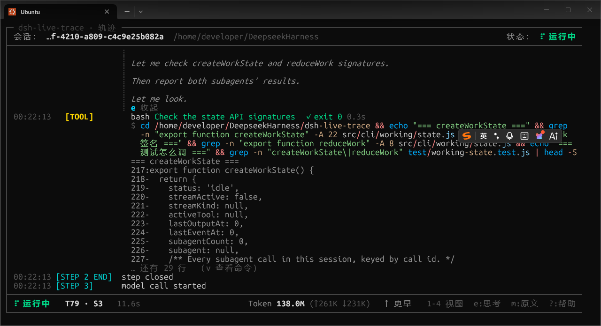
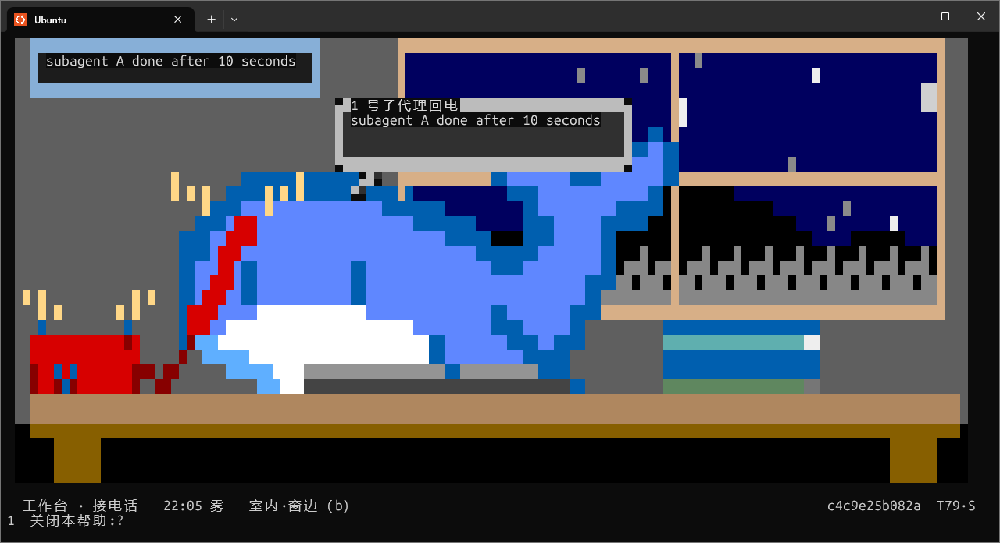
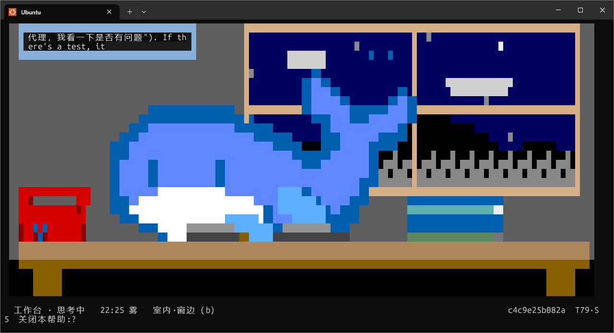
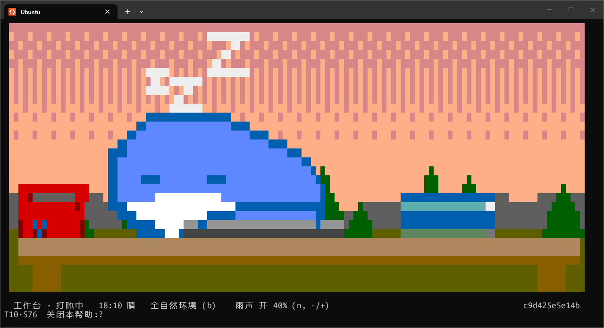

# dsh-live-trace

**English** · [中文](README.zh.md)

Two **read-only** windows onto a running DeepSeek Harness session, rendered in a
terminal that is *not* the one running your agent:

| Command | What it is |
| :--- | :--- |
| **`dsh-live-trace`** | the dashboard: a live trace of turns, steps, tools, output, tokens |
| **`dsh-live-working`** | the orca: one animated scene showing what the agent is doing right now |

Both attach to the same running Harness process over the same local socket and
neither ever sends anything to the agent.





| Thinking | Sleeping |
| :---: | :---: |
|  |  |

## `dsh-live-trace` — the dashboard

The Harness Web UI shows a conversation. This shows the *machine*: which turn and
step the loop is on, which tool is executing, what came back, what the model is
streaming right now, how long it has been running, and how many tokens have been
spent — updating continuously, so you can tell at a glance whether the agent is
working or stuck.

```
┌─ dsh-live-trace ─────────────────────────────────────────────────────────────┐
│ Session: …8-4222-8d66-0bb3b8c30c45 · live trace demo       Status: ⠇ running │
├──────────────────────────────────────────────────────────────────────────────┤
│ 10:19:00 [TURN 3]    ─────────────────────────────────────────────────────── │
│ 10:19:00 [STEP 1]    model call started                                      │
│ 10:19:00 [USER]      把登录逻辑抽到 src/auth.ts，并补上测试                  │
│ 10:19:02 [ASSISTANT] 先读一下现有的登录代码，确认调用点，再决定抽象边界。    │
│ 10:19:02   [TOOL]      read_file path="src/login.ts"                         │
│ 10:19:02   [RESULT]    ✓ 返回 234 行  0.2s                                   │
│ 10:19:03   [TOOL]      bash command="npm test" description="Run the test…"   │
│ 10:19:03   [RESULT]    ✓ 测试通过 (12 passed)  0.2s                          │
│ 10:19:05   [APPROVAL]  bash — runs outside the sandbox                       │
│ 10:19:06   [APPROVAL]  decision: allowed-once                                │
│ 10:19:06 [STEP 2]    model call started                                      │
│ 10:19:06 [ASSISTANT] 已完成：登录逻辑抽到了 src/auth.ts，12 个测试通过。     │
│ 10:19:06 [TURN 3 END] completed                                              │
├──────────────────────────────────────────────────────────────────────────────┤
│ ⠇ running   T3 · S2   12.3s     Tokens 4.2K/1.0M (↑3.8K ↓180)   q:quit       │
└──────────────────────────────────────────────────────────────────────────────┘
```

Four panels share the same chrome:

| Panel | Key | Shows |
| :--- | :--- | :--- |
| **trace** | `1` / `t` | the chronological event log, with Markdown-rendered model prose and one block per tool call |
| **sessions** | `2` / `s` | every concurrent `dsh` session, live; this is also the landing screen when more than one is running |
| **edits** | `3` / `d` | every file the model changed, with a unified diff |
| **commands** | `4` / `c` | every shell command, its output, exit status, and duration |

```
┌─ dsh-live-trace · commands ──────────────────────────────────────────────────┐
│ Session: …a-412e-ac3d-c0f6a5bc824f · explain the plugin     Status: ● idle   │
├──────────────────────────────────────────────────────────────────────────────┤
│ COMMANDS                                                               2 run │
│ ──────────────────────────────────────────────────────────────────────────── │
│   ✓ ls -1 dsh-live-trace && echo "--- entry ---" && head -4 …   0.1s  exit 0 │
│     Inspect the plugin package layout                                        │
│     README.md  bin  cordis.patch.yml                                         │
│     … 13 more lines                                                          │
│                                                                              │
│ ▸ ✓ cd dsh-live-trace && node --test test/width.test.js …      0.3s  exit 0 │
│     Run the measurement and tool-helper tests                                │
│     ✔ every wrapped line fits the width budget (30.5ms)                      │
│     ℹ tests 22                                                               │
├──────────────────────────────────────────────────────────────────────────────┤
│ ● idle   T1   2.9s           Tokens 21K/1.0M   ↓7   1:trace  d:edits  ?:help │
└──────────────────────────────────────────────────────────────────────────────┘
```

Model prose is rendered as Markdown — headings, lists, tables, inline styles —
and every fenced code block is syntax highlighted, including the text that is
still streaming. **Thinking is collapsed by default**: a few lines and a marker
saying how much more there is; `e` opens every block. Shell commands are shown
the way a terminal shows them, with the command itself syntax highlighted:

```
│                      ┊ 先确认 login() 的所有调用点，再决定抽象边界。         │
│                      ┊ 1. 只有两处直接调用，都在 src/routes/ 里。            │
│                      ┊ … 5 more lines  e to expand                           │
│ 11:58:09   [TOOL]      bash Run the test suite  ✓ exit 0 0.2s                │
│                        $ npm test                                            │
│                        测试通过 (12 passed)                                  │
```

`$` is dim, the command name is a function colour, flags are attributes,
operators and quoted strings each get their own token colour.

```
│                       │ 检查 │ 结果       │
│                       │ 测试 │ 12 passed  │
│                       │ lint │ 2 warnings │
│                       │                                                 bash │
│                       │ $ npm test                                           │
│                       │ ✓ 12 passed                                          │
```

It is **not** a TUI chat client. It never sends anything to the agent.

---

## How it works

```
┌──────────────────────────── dsh web / dsh headless / dsh tui ─────────────────┐
│  Host process                                                                 │
│                                                                               │
│   Cordis event bus ──► dsh-live-trace plugin ──► TraceHub ──► unix socket     │
│   session/event                (normalize)      (state)      $DSH_HOME/       │
│   agent/assistant-stream                                      live-trace/     │
│   agent/status, agent/error                                   sockets/*.sock  │
└───────────────────────────────────────────────────────────────────────────────┘
                                                                     ▲
                                                    newline-delimited JSON
                                                                     │
┌──────────────────────────── another terminal window ─────────────┐ │
│  dsh-live-trace (separate process, read-only)  ──────────────────┘ │
│  alternate screen · ANSI renderer · scroll · replay on attach       │
└─────────────────────────────────────────────────────────────────────┘
```

**One correction to the obvious design.** A Cordis plugin is not a separate
process: `ctx.on('session/event', …)` fires inside the process running the
Harness. So the split is:

- a **Host plugin** (`index.js`) that observes in-process and publishes
  normalized records on a Unix domain socket, and
- a **standalone viewer** (`bin/dsh-live-trace.js`) that runs in its own
  terminal, connects to that socket, and renders.

The plugin is read-only in the strongest sense available: it appends no session
events, registers no tool hooks, rewrites no prompt, and never writes to stdout.
It only listens.

A Unix socket (rather than a TCP port) is deliberate: it cannot be reached from
another host, it cannot collide with the Web UI's port, it needs no
authentication story, and its file permissions are the access control.

### Event vocabulary actually used

The Harness publishes a small, exact set of events. The dashboard maps them as
follows; anything else is a plugin's own event type and is hidden unless
`showUnknownEvents: true`.

| Source event | Label | Notes |
| :--- | :--- | :--- |
| `session/created` / `session/disposed` | `[SESSION]` | session lifecycle |
| `turn/start` / `turn/end` | `[TURN n]` / `[TURN n END]` | turn opening renders as a rule |
| `step/start` / `step/end` | `[STEP n]` / `[STEP n END]` | one model call per step |
| `user/message` | `[USER]` / `[CONTEXT]` | injected context is labelled by its `source.kind` |
| `assistant/message` | `[ASSISTANT]` | text plus a `thinking:` excerpt; carries token usage |
| `assistant/attempt` | `[ATTEMPT]` | an attempt that committed no message |
| `tool/call` + `tool/result` | `[TOOL]` | **one block**: name, the command it ran, its output, `✓`/`✗ exit N`, and duration. The two records share a `key`, so the result upgrades the running row in place. |
| `tool/result` `meta.diffs` | `[TOOL]` + *edits* | applied file hunks; a newly created file (no prior text) is rebuilt from the call's `content` argument |
| `approval/asked` / `approval/decided` | `[APPROVAL]` | also raises **waiting for approval** |
| `session/title` | `[TITLE]` | also updates the header |
| `permission/preset`, `sandbox/mode`, `approval/policy` | `[POLICY]` | one line each at startup |
| `agent/assistant-stream` (live) | `thinking` / `writing` | coalesced, never per chunk; reasoning and visible text get their own rows |
| `agent/status`, `agent/error` (live) | status bar / `[ERROR]` | |
| `request/context` | *(footer)* | supplies the context-window denominator |

There is no `assistant/chunk` event on the bus — live streaming is
`agent/assistant-stream`, whose chunk frames are accumulated and published on a
fixed cadence (`streamIntervalMs`, default 500 ms) so a fast model cannot flood
the terminal. The durable `assistant/message` settles the stream.

---

## Install

There are two halves: the **plugin**, which the Harness loads so it can publish
session events, and the **viewer**, which is the command you run.

### The plugin

Published as [`dsh-live-trace`](https://www.npmjs.com/package/dsh-live-trace) on
npm. The plugin must be selected by the profile your Harness boots.

**A. From npm**

```sh
dsh plugin --profile web add dsh-live-trace
```

then add `"dsh-live-trace"` to `dsh.profile.bundles` in
`$DSH_HOME/profiles/web/package.json`.

**B. File-level installer (offline, no package manager)**

```sh
node /path/to/dsh-live-trace/scripts/install-profile.mjs --profile web
```

It adds `dsh-live-trace` to the profile's `dsh.profile.bundles`, adds a
`link:` dependency, and symlinks the package into the profile's `node_modules`.
Restart the Harness (or let hot reload pick it up).

**C. From a checkout, pnpm-managed**

```sh
dsh plugin --profile web add /path/to/dsh-live-trace
```

then add `"dsh-live-trace"` to `dsh.profile.bundles` in
`$DSH_HOME/profiles/web/package.json`. This path needs `pnpm` on `PATH`.

To undo either: `node scripts/install-profile.mjs --profile web --uninstall`.

### The viewer

```sh
npm install -g dsh-live-trace
```

That puts three commands on `PATH`: `dsh-live-trace` (the dashboard),
`dsh-live-working` (the orca) and `dsh-glyph-probe` (which prints what your
font can render). From a checkout instead, run them out of `bin/` or link them
by hand:

```sh
npm install -g .
```

Verify the composition without starting anything:

```sh
dsh --profile web --dump-config | grep -A4 'dsh-live-trace'
```

### Run the dashboard

```sh
dsh-live-trace
```

With the plugin loaded, the Harness publishes a discovery record under
`$DSH_HOME/live-trace/servers/` naming its socket, working directory, and
sessions. The viewer prunes dead records, prefers a process in the current
working directory, and binds to the newest active session.

```
dsh-live-trace --list                       # what was discovered, then exit
dsh-live-trace --session <id>               # bind one session
dsh-live-trace --socket <path>              # bypass discovery entirely
dsh-live-trace --runtime-dir <path>         # non-default $DSH_HOME
dsh-live-trace --plain                      # one line per event, pipe-friendly
dsh-live-trace --wait                       # poll until a Harness appears
```

### Keys

| Key | Action |
| :--- | :--- |
| `1` / `t` | trace panel |
| `2` / `s` | session picker (`esc` returns to the panel underneath) |
| `3` / `d` | file changes panel |
| `4` / `c` | commands panel |
| `tab` | cycle panels |
| `↑` / `↓` | scroll the trace, or move the selection in a list panel |
| `PgUp` / `PgDn` | scroll one page |
| `Home` / `End` | oldest / newest |
| `enter` | bind the highlighted session |
| `esc` | leave the picker, then the panel; quits only from the trace |
| `e` | expand or collapse every thinking block |
| `m` | toggle Markdown rendering (show the raw source) |
| wheel | scroll three lines per notch (any panel) |
| click | select the row under the pointer |
| `p` | pause or resume following new entries |
| `r` | ask the plugin to replay this session |
| `?` | key help |
| `q`, `Ctrl-C` | quit |

### Landing screen

`dsh-live-trace` opens the **session picker** when more than one session is
running and no `--session` was given — with several concurrent `dsh` sessions,
choosing is the first thing you need to do. With exactly one session it goes
straight to the trace, and an explicit `--session <id>` always wins.

## Multi-session switching

Every session the Harness knows is listed live, with its activity, turn, step,
how long it has been quiet, its title, and its working directory. `↑`/`↓` moves
the selection and `enter` binds it; the plugin then replays that session's
backlog, so switching never leaves you with a blank panel. If the session you
are following ends, the viewer follows the next active one automatically.

---

## Configuration

Every key is optional; the plugin validates defensively and falls back to the
default rather than refusing to start. Put them in
`$DSH_HOME/profiles/<profile>/cordis.patch.yml`:

```yaml
- id: dsh-live-trace
  config:
    enabled: true
    streamIntervalMs: 500      # 50…60000 — coalesced streaming cadence
    backlogSize: 2000          # 10…100000 — entries retained per session
    heartbeatMs: 5000          # discovery/heartbeat cadence
    replayLimit: 500           # entries replayed to a late-joining viewer
    showSystemMessages: false  # render the system prompt as an entry
    showRequestMetadata: false # render request/header as entries
    showUnknownEvents: false   # render unrecognized plugin events
    mutedEventTypes:           # `*` is a prefix match
      - 'session-log-deepseek/*'
    textLimit: 4000            # cap on one entry's primary text
    outputLines: 200           # 1…100000 — command output lines retained
    outputChars: 20000         # 200…1000000 — command output characters retained
    runtimeDir: null           # override $DSH_HOME/live-trace
    socketPath: null           # override the derived socket path
```

The plugin declares no `Config` schema on purpose: it must load in a profile that
cannot resolve a schema package, and a mistyped option should degrade to its
default rather than block startup.

---

## Wire protocol (v1)

Newline-delimited JSON over the socket. Every record carries `v` and `kind`;
unknown kinds are ignored in both directions, so either half can be upgraded
first.

**Plugin → viewer:** `hello` (server identity, session list, active session),
`sessions`, `entry` (one normalized trace line), `stream` (coalesced live text),
`stream-end`, `status`, `usage`, `edits`, `heartbeat`, `error`.

**Viewer → plugin:** `select` (bind a session; omitted id means "the server's
default"), `replay`, `ping`.

An `entry` may carry a `key`; two records with the same key are one row, the
later one replacing the earlier in place. That is how a tool call and its
settlement stay one block instead of two half-lines.

Session-scoped records reach only viewers bound to that session, and `sessions`
records are personalized with the `boundSessionId` each viewer actually holds.
A viewer that names no session keeps asking until one exists, then follows it —
so opening the dashboard before the first session works, and a session that ends
hands the view to the next one.

---

## Verification

`npm test` runs 243 tests (`node --test`), including:

- **Renderer invariants** — for widths 24…200 and heights 8…60, every frame row is
  *exactly* the terminal width, including with CJK text, emoji, and content that
  tries to inject escape sequences.
- **Measurement** — `displayWidth` counts Han/Kana/Hangul/emoji as two cells,
  combining marks as zero; wrapping and truncation never split a wide character.
- **Normalization** — every mapped event type, plus malformed arguments,
  unknown errors, and unknown event types.
- **Markdown and highlighting** — a hard character-preservation invariant for
  every supported language, the width bound across six widths for a document
  battery and an adversarial fuzz, unterminated fences (the streaming case), and
  tables.
- **Tool blocks, diffs, and commands** — call/result pairing by key, the shell
  exit-status marker contract (`[exit code: N]`, `[killed by signal: X]`),
  diff-metadata narrowing, whole-file reconstruction for a created file, and
  per-path accumulation across repeated edits.
- **Panels** — every panel keeps the exact-width contract at every size, and
  each one explains an empty session instead of showing a blank box.
- **Windowing** — a windowed frame paints byte-for-byte the rows the unbounded
  render would, at every size and scroll offset, and the scrollback ring buffer
  trims without losing its key index.
- **Input** — arrow/navigation keys, SGR mouse reports split across reads,
  wheel mapping, click press-vs-release, motion rejection, and a bounded buffer
  for unterminated sequences.
- **Transport** — NDJSON framing across split chunks, per-viewer session
  routing, replay on attach, reconnect after a server restart, and teardown.
- **Integration against the real Harness** — boots the shipped
  `@deepseek-ai/dsh-session` plugin in a real Cordis context, creates and appends
  real sessions, and asserts what a viewer receives over a real socket. It skips
  cleanly when no Harness install is present.
- **End-to-end CLI** — spawns the real `dsh-live-trace` binary against a real
  observer socket: discovery, `--list`, the alternate-screen board quitting on
  `q`, 80-column row widths in the captured output, plain mode, and the
  no-observer diagnostic.
- **Teardown leaves nothing behind** — three mount/unmount cycles accumulate no
  instance, socket, or registry record; and a separate program that boots
  everything and disposes must **exit on its own**, so a live socket or interval
  would hang it. Removing the disposal call from that program makes it hang,
  which is the negative control proving the check has teeth.

Beyond the suite, the package was verified against an installed Harness:

1. `dsh --profile web --dump-config` composes the plugin row and applies the
   user's patch layer to it.
2. A real `dsh web` process starts the plugin, which creates its socket and
   discovery record; `dsh-live-trace --list` finds it and the board attaches.
3. A real `dsh headless` agent loop (driven by `scripts/mock-provider.mjs`, an
   offline Messages-API server) streams genuine turn, step, tool, result, and
   token events into the board, including a real `write` whose applied diff
   reaches the edits panel.

## `dsh-live-working` — the orca

The dashboard tells you what *happened*. This tells you what is happening: a
pixel-art orca at a desk with a keyboard, a stack of books and a red telephone,
animated to match the session.

```
                    ▄█接 2 号子代理████████████████▄
                    ██把 auth 模块里的校验逻辑抽出来██
                    ▀██████████████████████████▀
                       ▄█▀
                      ▀▀                     ▄▄██▄▄▄▄
                                             ▀▀▀▀▀▀▀▀    ▄▄
                                   ████████            ██████▄▄
                                     ▄▄▀▀              ████████▄▄
                                   ████████            ████████████
        ██████████   ▄▄██████████████████▄▄▄▄            ▀▀██████████
        █        █ ▄▄████████████████████████▄▄▄▄          ████████▀▀
               ▄▄█████████████████████████████████▄▄    ▄▄██████
               ██████████████████████████████████████▄▄▄▄██████
               ████████████████████████████████████████████████
               ██████████████████████████████████████████████
               ▀▀██████████████████████████████████████████▀▀
                 ▀▀██████████████████████████████████████▄▄▄▄▄▄
                   ▄▄██████████████████████████████████████████
                   ████████████████████████████████████████████
 ▄██████████▄      ██████████████████████      ████████████████
 ████████████      ██████████████████████      ████████████████
     ██████████████████████████████████████████████████████████████████
     ██████████████████████████████████████████████████████████████████
        ███                                                      ███
```

The scene is **sized to your terminal** — up to 200 cells wide, and the orca is
drawn at 1×, 2× or 3× depending on the room, so a wide terminal gets a big
creature rather than the same one floating in the middle of a large empty desk.
Pixel art is only ever scaled by whole numbers; a fractional scale produces
uneven blocks that look like a rendering fault.

The sprite is sampled from the reference artwork at its **native 64×40 pixel
grid** (the artwork's blocks are five source pixels across), so no row of the
original is dropped. The grey marks above the whale in the source are the three
`Z` glyphs of a *sleeping* whale illustration — they are excluded when sampling,
so the creature sits on a clean transparent background and the scene draws its
own `z`s, and only while it is actually asleep.

### What it does, and why

| State | Trigger | Animation |
| :--- | :--- | :--- |
| `sleep` | no work; **or** a running command that has printed nothing for 8s | eyes closed, a slow bob, `z`s drifting up |
| `thinking` | reasoning is streaming, or the agent is waiting for approval | hands off the keys, a trail of thought dots |
| `typing` | prose or code is streaming | keys light in a sweep |
| `writing` | a write/edit tool is running | a sheet on the desk gains a line |
| `waiting` | a shell command is running and still talking | a terminal block with a blinking cursor |
| `reading` | a read/glob/grep tool is running | **squints, and blinks every few seconds**, holding a book open |
| `searching` | a web search or fetch is running | **a page turns**, sweeping right to left across the spine |
| `calling` | a subagent was started | **the red telephone is picked up and held to the ear at an angle**, hands off the keyboard, and a bubble |
| `ringing` | a subagent finished | the telephone **rings and shakes**, and the bubble shows what it came back with |

### Two backdrops: `room` and `nature`

`--scene room` (the default) is a desk by a window: a wall with a window in it,
and the sky confined to the pane. `--scene nature` takes the wall away — the
backdrop *is* the outdoors, so the weather covers the whole scene, the ground
runs to the bottom of the screen and the desk stands on it, and conifers stand
along the horizon. Press `b` to swap between them at any time.

Both are built from the same sky. The window and the outdoors both composite
their contents on their own canvas before blitting, so the containment
guarantee — nothing escapes the area it was given — holds for either.

### The room

**The room is lit by its window.** The wall, its shading, the skirting and the
floor are derived from the sky each frame, so the room darkens at night and
brightens at noon instead of being a fixed mid grey — a bright grey slab beside
a black sky was the single worst thing about the night scene. The wall runs
`181,176,166` at noon to `64,66,75` at midnight, and never falls below a floor,
so the room stays readable.

The scene is a room, not a sprite floating on whatever the terminal's background
happens to be: a wall with faint paper stripes, a skirting board where it meets
the floor, and the desk standing on that floor. The window is an **opening in
the wall**, so there is something for everything else to be read against — the
sleeping `z`s in particular, which used to be drawn over the sky and disappear
into a cloud — and then, once moved onto the wall, were a mid grey on a mid
grey wall. They have a colour of their own now.

Everything the window contains — sky, sun and moon, clouds, rain, snow, fog — is
composed on the window's own canvas and blitted in, so none of it can drift out
of the opening and across the wall.

### Out of the window

In the wall is a window onto a world that keeps its own time. **One in-game
minute passes per real second**, so a full day takes twenty-four real minutes
and the sky is never still: a colour that runs from midnight blue through dawn
orange to noon blue and back, the sun and moon taking turns on an arc across the
panes, stars that only come out at night.

It rains there too. Weather changes on its own every three in-game hours, picked
from the spell's number rather than a random number generator, so two viewers
watching the same session see the same sky. It fades in and out rather than
snapping on, and **snow falls at night where rain falls by day** — the same
weather, one temperature apart.

The window is a picture, not a colour swatch:

- **The sky is a gradient.** A terminal has no alpha, but it has a grid: two
  colours and a 4x4 Bayer dither make the sky darker overhead and lighter
  towards the horizon, and turn the horizon warm at dawn and dusk while the top
  stays cold. Two flat colours read as a band; the dither reads as a sky.
- **There are hills.** A rolling ridge along the bottom of the pane gives the
  window somewhere to be, and the sun and moon set behind it.
- **The sun and moon have a halo**, dithered so it fades out instead of stopping
  dead.
- **Clouds are cumulus**, three overlapping ellipses with a flat underside —
  not the horizontal bars they started as.
- **Fog is a haze, not a band.** It covers a quarter of the pane instead of a
  third, is at most half-filled, thins out as it rises, and takes its colour
  from the sky rather than being a fixed light grey — so it fades into the
  weather instead of reading as a grey stripe. Measured, it went from 23% of the
  pane to 5%.
- **Stars come in two brightnesses**, and twinkle on their own clock.

The weather **takes light out of the sky**: a clear noon is 535 of a possible
765, cloudy 439, rain 331, and a storm 240. Heavy weather also hides the sun or
the moon, which is what makes it read as heavy. Stars come out only when the sky
is genuinely dark — keying them off the phase instead put white dots in a bright
orange dawn. The footer carries the in-game clock and the current weather.

**It can rain out loud.** `--sound` (or `n` at any time) plays rain through
whichever of `aplay`, `paplay`, `sox` or `ffplay` is installed, and only while
it is actually raining. It is **off by default**, because a command that starts
playing audio on its own is a command people stop running.

**The level is a separate control.** `--rain-volume <0-100>` sets it (default
`40`), `-` and `+` move it by 5 while the command runs, and the footer shows the
current level next to the sound state. It starts at 40 rather than at full scale
on purpose: the recording peaks at -6.1 dBFS, which is a foreground level, and
at 40% it peaks around -14 dBFS — ambience rather than something to switch off.
The synthesised noise is scaled by the same fraction, so it went from a mean
sample of 2023 to 809 (peak 5898 to 2359, -14.9 to -22.9 dBFS): the same rain,
less of it.

The level reaches the speakers on every path except one. In **file** mode
`paplay` gets `--volume`, `sox` gets `-v`, and `ffplay` gets `-volume`; the
synthesised stream carries its level in its own samples, so every player honours
it there. **`aplay` has no volume argument at all**, so a recording played
through `aplay` is heard at whatever level it was recorded at. That is not
quietly ignored: the footer says `aplay cannot change a file level` instead of
printing a percentage that would be a lie. If you want a quieter recording on an
`aplay`-only machine, pass a quieter `--rain-file` or install `paplay`, `sox` or
`ffplay`.

The default source is the bundled recording. `--rain-file` names another. If a
file is missing — or the asset cannot be read — it falls back to **synthesised**
noise: a low-passed run of pseudo-random samples, streamed forever with no loop
point. That is what keeps the feature working on a machine with nothing but a
player.

Changing the level while a recording is playing restarts the player, because the
level lives in its command line; the synthesised stream picks the new level up
on its next chunk without a gap.

Changing the level restarts the player, because the level is an argument to it.
The old player is stopped first, but its exit event lands *after* the new one is
already running — so state updates are ignored unless they come from the process
that is still current, and every process ever started is tracked and killed
together. Without both, a level change left two rain sounds playing and an
orphaned player that kept going after the command exited.

A player that dies the moment it starts has no audio device; it is retried three
times and then left alone, rather than restarted forever.

**A rain loop ships with the package.** `assets/rain.ogg` (30 s, mono, 64 kbps,
242 KB) is the default source, so `--sound` needs no arguments. It was cut from
the 8-hour recording `42130539966-1-192.mp4` — its audio is aac 48 kHz stereo —
at the one-hour mark, and the tail was crossfaded into the head so the loop has
no click: the two ends match in level to within 20% and the sample gap at the
seam is 0.35% of full scale. It peaks at -6.1 dBFS; at the default level of 40%
that is about -14 dBFS. `--rain-file` overrides it.

**About a 2.2 GB `42130539966-1-192.mp4` sitting in this directory:** it is not
part of the package (`package.json`'s `files` list does not include it, and
`.gitignore` ignores `*.mp4`), and this machine has no `ffprobe`, `ffmpeg`,
`aplay`, `paplay`, `sox` or `mpv` — `ffplay` is present, but it can play a file,
not inspect one — so the video can be neither inspected nor played here.
`--rain-file` takes an audio file; an `.mp4` is a video container
and would need its audio track extracted first, which needs `ffmpeg`:

```
ffmpeg -i 42130539966-1-192.mp4 -vn -ac 1 -ar 44100 rain.wav
dsh-live-working --sound --rain-file rain.wav
```

For a real recording, pass `--rain-file`; `--rain-volume` still applies to it on
every player that has a volume argument:

```
dsh-live-working --sound --rain-volume 25 --rain-file ~/sounds/rain-loop.wav
```

A file that does not exist is dropped with a fall back to the synthesised noise
rather than going silent. `ffplay` loops a file natively; the other players are
restarted when the file ends, but only while it is still raining. Licensing is
your call and your responsibility — this ships no audio of its own:

- [Wikimedia Commons: Sounds of rain](https://commons.wikimedia.org/wiki/Category:Sounds_of_rain) — freely licensed, per-file terms
- [Freesound](https://freesound.org/) — filter by licence; CC0 needs no attribution
- [Creazilla: Ambience Rainstorm](https://creazilla.com/media/audio/15525146/ambience-rainstorm) — royalty-free
- [Internet Archive: Red Library — Nature Rain](https://archive.org/details/Red_Library_Nature_Rain)

```
工作台 · 等待命令   06:13 雾            c4c9e25b082a  T23·S19  关闭本帮助:?
```

### The orca's own motion

- **The tail is drawn, one pose per state.** The source art has a single
  upright tail and nowhere to move it: the flukes reach the last row of the body
  and the right edge of the sprite, and the desk sits on the bottom line. Six
  transforms were tried against it — shear, fold, rotate, tapered shear, rigid
  slide, levelled fold — and every one traded one artefact for another: a frayed
  edge, a torn silhouette, a tail under the table, a spike above it, or a hole
  showing the background through. There are now **two poses**, composed from the
  body plus a tail:

  - `up` is lifted straight out of the source art, pixel for pixel, so the awake
    orca is exactly what the reference drew;
  - `sleep` is drawn: the flukes come down and lie along the body at the desk
    line, tapering to a rounded tip, with its edge generated rather than handed
    to the renderer to guess.

  A drawn pose cannot lose a pixel, tear, or leave a gap — those failures are
  impossible by construction rather than merely fixed.

- **The awake tail sways from its base.** The whole tail used to shift rigidly,
  which pulled it away from the body and let the background show through the
  seam; the columns nearest the body are now anchored and only the outer part
  swings, so the tail pivots instead of sliding. It holds still while the orca is
  on the telephone, because the flippers are busy.

- **At night it rubs its eyes** — every so often while working it shuts them and
  lifts a flipper to its face, then carries on where it was. Only at night, and
  never while asleep or on the telephone.

### The desk

The desk is staged rather than pasted on: the keyboard is a small dark bar on
the desk, and a **framed window in the upper right shows the text being typed** —
the tail of the model's output, or the arguments of the tool it is running. The
window's frame is drawn whenever the text is, because text without a frame reads
as a stray bubble floating at the top of the terminal.

The orca's **flippers move** while it types, in a blue a shade off its body so
the limb reads as a limb. The sampled reference art is a side view with no
separate pectoral fin, so the paddles are drawn and animated on top of the keys;
they are **tucked away when it sleeps**. A telephone call stops the typing
entirely — the handset is held against the face, up by the eye and down past the
chin, rather than laid across the body or standing upright on the desk.

The book is shaded, which is what makes a page turn legible: the two pages of a
spread are lit differently, the gutter between them falls into shadow, and a
leaf caught mid-turn is edge-on and darker than either.

The telephone bubble reads `接 N 号子代理，<instructions>` (or `Subagent #N —
<instructions>` in English), where N counts the subagents in the session and the
instructions are the arguments the call was given.

### The telephone

Dispatching a subagent is a telephone call, and the whole exchange is modelled
that way:

- **The bubble shows the call as it was written**, not just the instruction
  inside it: `task(description="…", prompt="…")`, with the tool name and every
  argument. With several subagents out at once the header becomes a queue —
  `接 3 号子代理（共 5 个，排队 2 个）`.
- **The message is spoken**, a character at a time, and the bubble shows three
  rows of it. Longer messages scroll. The header is pinned above them: it is
  what says who is on the line, so losing it to a long instruction would leave
  the bubble anonymous.
- **The telephone rings when a subagent hangs up.** The handset shakes and ring
  arcs appear either side of the phone, and the bubble shows the subagent's own
  closing text — its answer, not a summary of it.
- **A background dispatch is an acknowledgement, not an answer.** Starting a
  subagent in the background returns `started subagent <id>` immediately; the
  answer arrives later as a message from that agent. Only the second one counts,
  so a background subagent keeps its place in the queue instead of looking
  finished the instant it started.
- **The handset is picked up and put down**, not teleported: it eases off the
  cradle, rotates up to the ear, and retraces the same path on the way down,
  with the cord slackening as it rises.
- **History is not news.** The viewer replays the backlog when it starts, and
  every record carries its own timestamp. Stamping events with the wall clock
  instead made an hour of history look like it was all happening right now, so
  the telephone rang for subagents that had finished minutes earlier. Every
  timestamp now comes from the event.
- **Work handed out and nothing left to do means a nap.** With subagents out and
  no other tool running, the orca dozes at the desk exactly as it does when idle,
  and the ringing telephone is what wakes it.

The bubble is anchored over the orca's head with its tail pointing at the
speaker, and clipped to stay clear of the preview window. A speech bubble pinned
to the corner of the scene points at nothing and reads as a stray box floating
outside the interface — which is how it was reported, twice.

```bash
dsh-live-working                    # follow the server's default session
dsh-live-working -s <session-id>    # follow a specific one
dsh-live-working --state reading    # pin one animation, ignore the session
dsh-live-working --list             # show observers and sessions
```

With more than one session running it opens on a **session picker** rather than
guessing which one you meant; `s` reopens it, `↑`/`↓` choose, `enter` binds,
`esc` cancels.

Keys: `1`-`8` pin an animation, `0` returns to automatic, `s` choose a session,
`n` toggles the rain sound, `-` and `+` change its level, `l` switches language,
`?` toggles help, `q` quits.

```
dsh-live-working — a live orca animation for a DeepSeek Harness session

States: sleep, thinking, typing, writing, waiting, reading, searching, calling
```

`node scripts/demo-working.mjs` cycles every state without needing a session;
`node scripts/demo-working.mjs reading` holds one.

### How much resolution a terminal cell can carry

A character cell is about twice as tall as it is wide, so the choice of glyph
decides both the resolution and the *shape* of the pixels:

| packing    | pixels/cell | pixel shape | glyphs                | notes                                    |
| :--------- | :---------- | :---------- | :-------------------- | :--------------------------------------- |
| `half`     | 1 x 2       | square      | `▀ ▄ █`               | what this dashboard draws with           |
| `quadrant` | 2 x 2       | 1:2 tall    | `▘ ▝ ▖ ▗ ▚ ▞ ▛ ▜ ▙ ▟` | finer edges, but everything is stretched |
| `braille`  | 2 x 4       | square      | `U+2800..U+28FF`      | 4x the pixels, but every one is a dot    |

`half` is the only packing that is both **square** and **solid**, which is what
solid pixel art needs. `quadrant` doubles the horizontal count but its pixels
are twice as tall as they are wide, so a picture drawn for square pixels comes
out stretched. `braille` gives four times the pixels with square pixels, but the
dots have gaps around them, so a solid fills as a stipple — excellent for a
plot, poor for a whale.

Whether any of them is usable depends on your font, and a font without the
glyphs does not fail loudly: it substitutes boxes or blanks and the picture
quietly falls apart. So look:

```
dsh-glyph-probe
```

It prints a sample of each packing and a disc rasterised at that packing's own
resolution. The disc that comes out round and seamless is the one your font
supports.

### Can the program shrink the terminal's font?

**No.** There is no escape sequence for it. `ESC[?3h` switches between 80 and
132 columns rather than changing the font, and VTE/GNOME Terminal has no way to
do it at all — you can read that straight out of [the source
discussion](https://stackoverflow.com/revisions/0162962e-7b66-4d60-8df4-4278446e6220/view-source).
kitty's [text sizing
protocol](https://github.com/kovidgoyal/kitty/blob/f13c8cd4/docs/text-sizing-protocol.rst)
scales individual runs of text and is kitty-only.

Even where it might work, leaving it to the application is a bad trade: a crash,
a `SIGKILL`, a closed terminal or a dropped SSH session would leave the font
small with nothing left to restore it.

What a terminal *will* do is **report its geometry**, and that half is worth
having — `CSI 16t` returns the cell size in pixels and `CSI 14t` the text area.
`dsh-glyph-probe` asks for both and does the arithmetic:

```
Cell size      9x18 px   (aspect 0.50)
Cells          148x40
Drawing budget 11,840 pixels (two per cell)
Half the font  333x80 cells -> 53,280 pixels
```

Shrinking the font does not change the window's pixels; it changes how many
**cells** fit into them, and every extra cell is two more pixels of drawing.
That is the real gain, and it is the user's to make.

Two things are worth knowing before reaching for a higher-resolution packing:

- **The whale is at its source resolution.** The reference art is a 64x40
  sprite, so it has no more detail to give; upscaling it only makes bigger
  blocks. A finer whale needs finer artwork, not a finer renderer.
- **The scene already fills the terminal.** It renders at up to 200 cells wide
  and uses every row it can, so the cheapest way to more precision is a larger
  window — more cells is more pixels, whatever the glyphs are.

## Both session lists lead with the title

`dsh-live-working`'s chooser and `dsh-live-trace`'s session panel both show the
session's title first, with the shortened id after it. The id is what you type
and the title is not unique, so both are shown — but the title is what you
recognise, so it comes first. A session without a title falls back to its id.

## Layout rules that were bugs once

- **Live thinking is a block, not a line.** Reasoning that is still streaming is
  wrapped and shown tail-first, `--thinking-lines` deep when collapsed and four
  times that when expanded. It used to be a single row holding the last few
  characters of the whole block, which is unreadable exactly when you want it.
- **Live thinking goes through the Markdown renderer.** It used to be wrapped as
  plain text, so `**bold**`, backticks and `[links](url)` were shown as their own
  syntax while the committed block below it rendered them — two different
  formats for the same reasoning.
- **The header never loses the session.** Segments carry a priority: the session
  id and the status label are essential and are never dropped, while the title,
  the path and the error text are dropped — title first — and then the status
  text is shortened rather than the session being squeezed out.

## Performance

`npm run bench` renders frames against growing logs. Because a frame only ever
shows the tail, per-frame cost must stay flat:

```
entries=    50  per-frame=   2.3ms
entries=  1000  per-frame=   2.9ms
entries= 10000  per-frame=   9.2ms
```

An earlier implementation rendered every entry per frame — 2100 ms per frame at
3000 entries, which is what made the wheel feel laggy on a long session. The
benchmark fails if the worst case exceeds 30 ms.

### Reproduce the live demo offline

```sh
node scripts/mock-provider.mjs &
DSH_HOME=/tmp/dsh-demo dsh --profile headless "explain the plugin" &
DEEPSEEK_BASE_URL=http://127.0.0.1:8799 DEEPSEEK_API_KEY=sk-mock dsh-live-trace
```

### See the board without any Harness

```sh
npm run demo          # scripts/demo.mjs — a scripted trace on the real renderer
```

---

## Design notes

- **Zero runtime dependencies.** The renderer is hand-written ANSI rather than
  `blessed`/`chalk`. `blessed` mis-measures CJK (the harness's primary audience
  writes Chinese), is unmaintained, and would force a network install into the
  profile; a `Segment[]`-based renderer keeps colors out of string parsing and
  makes the 80-column contract testable without a TTY.
- **The plugin cannot break the agent.** Every hub call is wrapped so an
  observer bug becomes a dropped line, never a failed turn. Nothing is written to
  stdout, which belongs to whatever surface the Harness is driving.
- **Cleanup is owned by the Cordis fiber.** Every `ctx.on` disposer is collected,
  every timer cleared, the socket closed and unlinked, and the discovery record
  removed — but only if it is still ours, so a hot-reload generation cannot
  delete its successor's record.
- **Repetition is collapsed, not hidden.** Consecutive identical entries render
  once as `×N` with the newest timestamp.
- **One row per tool call.** The plugin gives a call and its result the same
  `key` and stamps the duration on the settlement, so the trace shows one block
  per command rather than two lines the reader has to pair up by hand.
- **Reasoning and output are separate.** They are different things to watch, so
  the live indicator gives each its own row instead of one overwriting the
  other.
- **A frame only renders what it shows.** The trace is bottom-anchored, so the
  renderer walks entries backwards until the window is covered, and memoizes
  each entry's rows by identity. Both are needed: windowing bounds the work,
  the cache keeps a steady repaint nearly free.
- **The mouse is claimed deliberately.** Many terminals report the wheel as
  arrow keys, which is indistinguishable from a keypress and scrolls one line
  per notch. Claiming the mouse with SGR coordinates makes scrolling exact;
  `--no-mouse` gives the old behaviour back, and Shift+drag still selects text.
- **Elapsed time means the current turn**, or time in the current state when no
  turn is open. Session age would be misleading for a resumed session.

## Limits

- The socket transport is Unix-domain only; Windows named pipes are not
  implemented.
- `--plain` mode prints entries but not the live streaming preview.
- The footer's `S<n>/<m>` denominator is the highest step seen in the current
  turn, not a planned total — the Harness does not publish one.
- The diff panel has no line numbers: the Harness reports applied hunks with
  three lines of context, not positional ranges, so inventing numbers would be
  guessing.
- Markdown rendering is a purpose-built subset (headings, lists, tables, quotes,
  rules, fences, inline styles) with its own highlighter for 14 languages, not a
  full CommonMark implementation. `m` shows the raw source at any time.
- A file **created** by the model is reconstructed from the call's `content`
  argument, because a create has no prior text and therefore no hunks.
- The dashboard is read-only by design: there is no way to approve, cancel, or
  steer from it.

## License

MIT
